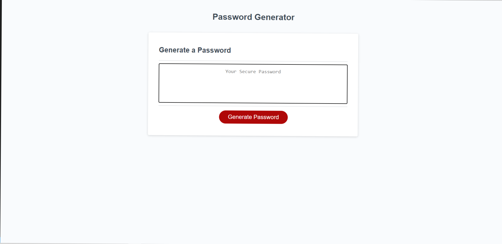
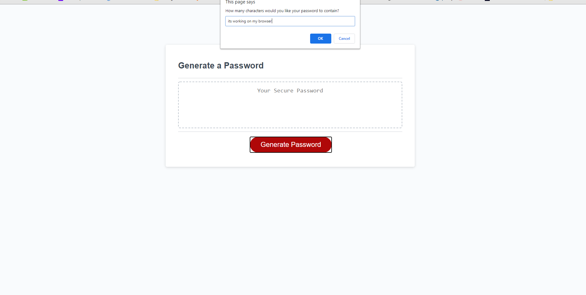
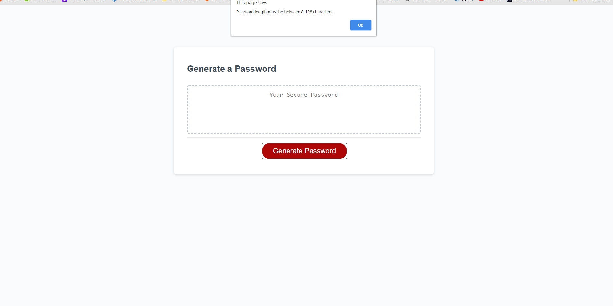
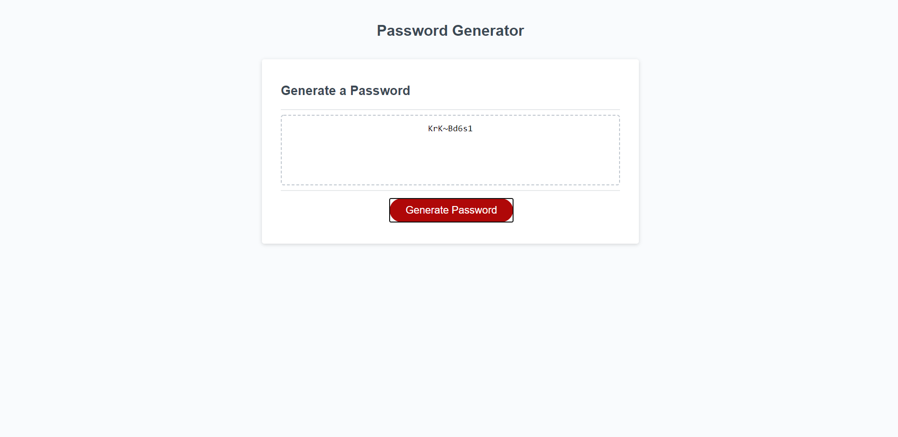

# Password Generator
This homework is creating a password generator that will generate a random password after answering a couple of prompts.

# Description
This application will generate a random password based on selection made by the user. The password generator will accomplish the following:
* Click the password generator button to begin the generator
* Select a password length between 8-128 when prompted
* Select whether to include lowercase, uppercase, numeric or special characters
* When all selection  has been made, the password generator will show the password in the password generator box

**Password Generator**

